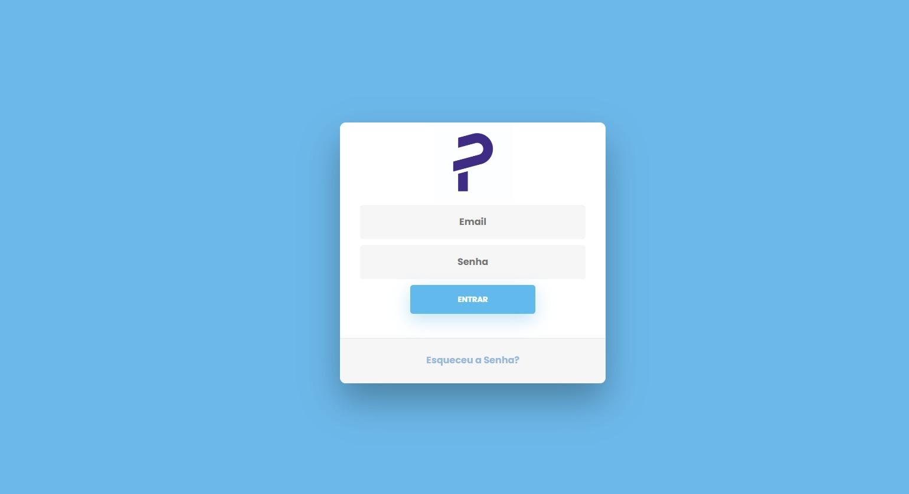
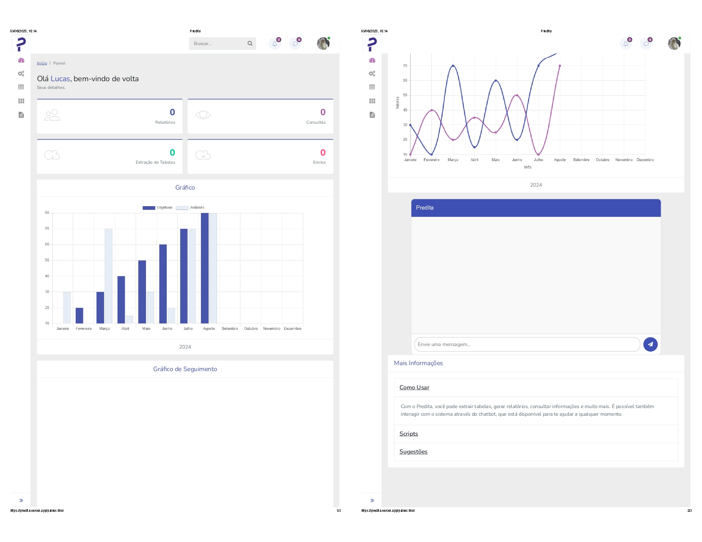
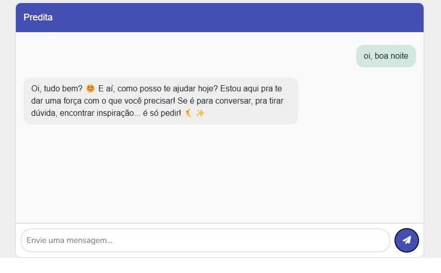

# 📚 Projeto Predita, uma forma de Análise Preditiva de Mercado Aprimorada por IA. 
Este projeto representa a divulgação da primeira versão final, 1.0, da Aplicação Predita; este que foi dividido em dois repositórios e será linkado abaixo. 

- Direitos reservados a Lucas Lira.


# FrontPredita

Interface web do projeto **Predita**, hospedada na Vercel, responsável pela experiência do usuário, autenticação, visualização de dados e interação com a inteligência artificial via chat.

## 🚀 Funcionalidades

- **Autenticação de Usuários:** Login com usuário e senha registrados no banco via API do [BackPredita](https://github.com/luqinias/BackPredita).
- **Cadastro de Usuários:** Formulário com verificação de e-mail (checagem de existência via Endpoint) e criação de novo Usuário.
- **Chat IA:** Integração com modelo DeepSeek via API externa (OpenRouter), permitindo conversação inteligente.
- **Redirecionamento de Páginas:** Navegação fluida entre diferentes áreas do sistema.
- **Visualização de Dados:** Gráficos e dashboards personalizados.

## 🛠️ Tecnologias Utilizadas

- **HTML, CSS e JavaScript** (Vanilla)
- Consumo de API REST (Fetch)
- Deploy: [Vercel](https://vercel.com/)

## 🔗 Integração

Consome a [API BackPredita](https://github.com/luqinias/BackPredita) para Autenticação, Cadastro, chat IA e Consulta de dados. O banco de dados também está hospedado no Render.

## 📦 Instalação Local

1. Clone este repositório:
   ```bash
   git clone https://github.com/luqinias/FrontPredita.git
   ```
2. Abra o arquivo `index.html` em seu navegador (ou rode um servidor local, se necessário).
3. Configure os endpoints da API do BackPredita, se necessário, no arquivo JS responsável pelas requisições.

## 📄 Principais Funcionalidades

- **Login:** Coleta dados do formulário e faz requisição POST para `/login` na API.
- **Cadastro:** Verifica existência do e-mail (`/check-email`), cria usuário (`/register`).
- **Chat IA:** Envia mensagens ao endpoint de chat do BackPredita, que repassa para a IA do DeepSeek.
- **Dashboards:** Gráficos e painéis para acompanhamento de dados do sistema.

## 🖼️ Exemplos de Telas

### Tela de Login


### Tela Inicial e Dashboard


### Chat com IA


## 📚 Projeto Relacionado

- [BackPredita (API)](https://github.com/luqinias/BackPredita)

---

🌐 **Contato:**
- [LinkedIn](https://www.linkedin.com/in/luc-aslira/)
-  Institucional: luc.aslira@ufu.br
-  Pessoal: lucasbizil@gmail.com

---

### Lucas Lira
1. Estudante em Engenharia de Computação pela Universidade Federal de Uberlândia
2. Técnico em Informática
   
- *Atualmente no meu tempo livre estudo e dedico à Backend: Java, Python, RPA, SQL, FastAPI.*
